If you're here you already finished part 1 and are ready to get into using your cluster! The goal for this part is to get all the remaining tools setup that we need before we start deploying applications and services. The tools we are going to be setting up in this guide are Kubernetes Dashboard, Cert-Manager, MetalLB, Rancher, and Longhorn. We are going to have our persistent storage on our cluster replicate between all nodes and also backup to the cloud, we are going to have the ability to dynamically generate SSL certificates based on application needs, we will be able to manage load balanced services from their own IP address, we will be able to deploy applications as well as manage them from a central web application, and finally we can monitor it all from a few different dashboards.

### Install Kubernetes Dashboard
First let's get the Kubernetes Dashboard out of the way. On our cluster this is incredibly simple to install and get running. First, let's run the following:

```shellscript
GITHUB_URL=https://github.com/kubernetes/dashboard/releases
VERSION_KUBE_DASHBOARD=$(curl -w '%{url_effective}' -I -L -s -S ${GITHUB_URL}/latest -o /dev/null | sed -e 's|.*/||')
sudo k3s kubectl create -f https://raw.githubusercontent.com/kubernetes/dashboard/${VERSION_KUBE_DASHBOARD}/aio/deploy/recommended.yaml
```

From here we need to create our admin user and setup some RBAC rules. First we are going to create a file called dashboard.admin-user.yml.

```yaml
apiVersion: v1
kind: ServiceAccount
metadata:
  name: admin-user
  namespace: kubernetes-dashboard
```

Now we are going to create a file called dashboard.admin-user-role.yml that sets up all the RBAC rules.

```yaml
apiVersion: rbac.authorization.k8s.io/v1
kind: ClusterRoleBinding
metadata:
  name: admin-user
roleRef:
  apiGroup: rbac.authorization.k8s.io
  kind: ClusterRole
  name: cluster-admin
subjects:
- kind: ServiceAccount
  name: admin-user
  namespace: kubernetes-dashboard
```

Now that we have both of these done, we need to deploy them

```shellscript
kubectl deploy -f dashboard.admin-user.yml -f dashboard.admin-user-role.yml
```

Now we need to obtain the bearer token

```shellscript
kubectl -n kubernetes-dashboard describe secret admin-user-token | grep '^token'
```

Next we start a proxy

```shellscript
kubectl proxy
```

Finally we can open our browser and load the page 

<http://localhost:8001/api/v1/namespaces/kubernetes-dashboard/services/https:kubernetes-dashboard:/proxy/>

We then login with the admin-user token from above.

To upgrade the dashboard we execute the following:

```shellscript
sudo k3s kubectl delete ns kubernetes-dashboard
GITHUB_URL=https://github.com/kubernetes/dashboard/releases
VERSION_KUBE_DASHBOARD=$(curl -w '%{url_effective}' -I -L -s -S ${GITHUB_URL}/latest -o /dev/null | sed -e 's|.*/||')
sudo k3s kubectl apply -f https://raw.githubusercontent.com/kubernetes/dashboard/${VERSION_KUBE_DASHBOARD}/aio/deploy/recommended.yaml -f dashboard.admin-user.yml -f dashboard.admin-user-role.yml
```

And to remove it completely

```shellscript
kubectl delete ns kubernetes-dashboard
kubectl delete -f dasbhoard.admin-user-role.yml
kubectl delete -f dashboard.admin-user.yml
```

### Setting Up Cert-Manager

Now it's time we get cert-manager running on our cluster. This automates the process of getting SSL certificates. It can be configured to use Let's Encrypt too if you want fully validated certs and not self-signed ones. You can set it up to use your org's CA too if you want. This is honestly a versatile tool that will help out so much in the long run if running public sites is on the agenda.

Let's add the helm chart repo we need

```shellscript
helm repo add jetstack https://charts.jetstack.io
helm repo update
```

Alright, we now need to install the Custom Resource Definitions. These extend the kubernetes api to use cert-manager.

```shellscript
kubectl apply --validate=false -f https://github.com/jetstack/cert-manager/releases/download/v1.5.1/cert-manager.crds.yaml
```

Make sure the version of cert-manager you choose matches the definitions you install.


Now that we have our repo and crds ready let's deploy cert-manager

```shellscript
helm install cert-manager jetstack/cert-manager \
  --namespace cert-manager \
  --create-namespace \
  --version v1.5.1
```

I'm going to break this down for you... cert-manager is the chart and we are installing from repo jetstack/cert-manager. The namespace cert-manager is the kubernetes namespace it will be deployed. Since the namespace doesn't exist, we are creating it. The version specification is important. The latest versions of cert-manager have api breaking changes and if you aren't running bleeding edge it is best to stick with 1.5.1, 1.5.3, or 1.5.4. I like 1.5.1 because it is what Rancher recommends.

After exectuting our command we can watch the status with

```shellscript
watch kubectl get all -n cert-manager
```

It should look something like this


It's really important that cert-manager is running correctly before we move on. If you have ImagePullErr just wait and you will see k3s grab the container image after a bit. If you have other errors you can check them on the individual parts using

```shellscript
kubectl logs -p <name of pod> -n cert-manager
```

Depending on what you see you will need to troubleshoot accordingly. Sometimes the simplest solution is to just remove the namespace, wait for everything to purge, and deploy the helm chart again. To delete a namespace it's just

```shellscript
kubectl delete namespace <namespace name>
```

That's as much troubleshooting as I'm going to get into here because that is a whole giant rabbit hole itself. Anyway, we should have a working cert-manager to generate self-signed certificates!! Yes!!! 

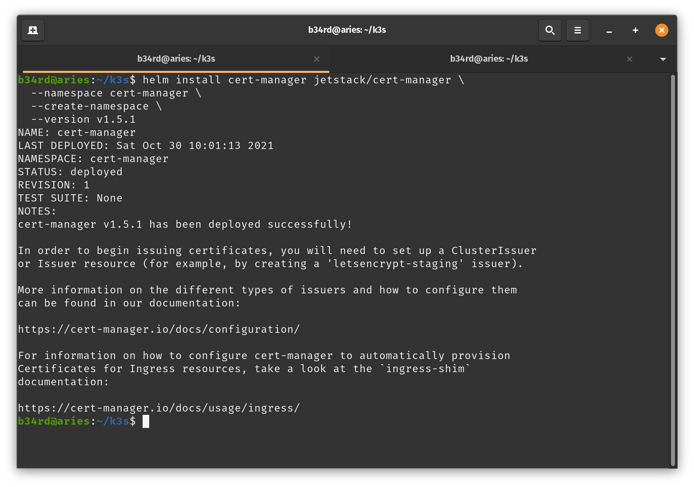

Here we can move on or we can add the configuration to setup Let's Encrypt certificates.

Let's go ahead and do that. We can choose whether or not to use them. First, I'm going to create a folder on my workstation called cert-manager so I can store my files. Next, I need to create two yaml files that have configurations for staging and production. 

Staging:

```yaml
apiVersion: cert-manager.io/v1alpha2
kind: ClusterIssuer
metadata:
  name: letsencrypt-staging
spec:
  acme:
    email: <EMAIL>
    server: https://acme-staging-v02.api.letsencrypt.org/directory
    privateKeySecretRef:
      name: letsencrypt-staging
```

Production:

```yaml
apiVersion: cert-manager.io/v1alpha2
kind: ClusterIssuer
metadata:
  name: letsencrypt-prod
spec:
  acme:
    email: <EMAIL>
    server: https://acme-v02.api.letsencrypt.org/directory
    privateKeySecretRef:
      name: letsencrypt-prod
```

We can then apply them both by browsing to our folder that has them and running:

```shellscript
kubectl apply -f .
```

Later on when we create ingresses to our cluser we can specify the certificates we want and whether we want staging or production ones.

### MetalLB Load Balancer Configuration

Now that cert-manager is good to go, let's get the next big step done. MetalLB is a load balancer that works really well outside of cloud environments. The load balancer that is part of k3s works great when in the cloud but doesn't do what we need it to do on our cluster. To get started, we need to add another helm repo.

```shellscript
helm repo add metallb https://metallb.github.io/metallb
helm repo update
```

Here we are going to need to grab the custom values yaml file so we can modify it for our use. I like to create folders for each item, browse to folder, and setup my yaml files there. Here's how to grab the values

```shellscript
helm show values  metallb/metallb >> metallb.values.yml
```

This is my config:

```yaml
---
configInline:
  address-pools:
   - name: default
     protocol: layer2
     addresses:
     - 192.168.1.200-192.168.1.220
---
```

You can create as many address pools as you like and name them as you see fit. A good example for this is if you want to have services like pihole or unifi to be in their own pool. You could create one called network-services with it's own addresses in this case. I'm just keeping everything in the one spot.

Let's get MetalLB deployed!

```shellscript
helm install metallb metallb/metallb \
   -f metallb.values.yml \
  --namespace metallb-system \
  --create-namespace
```

After a minute or so you should have something like this:

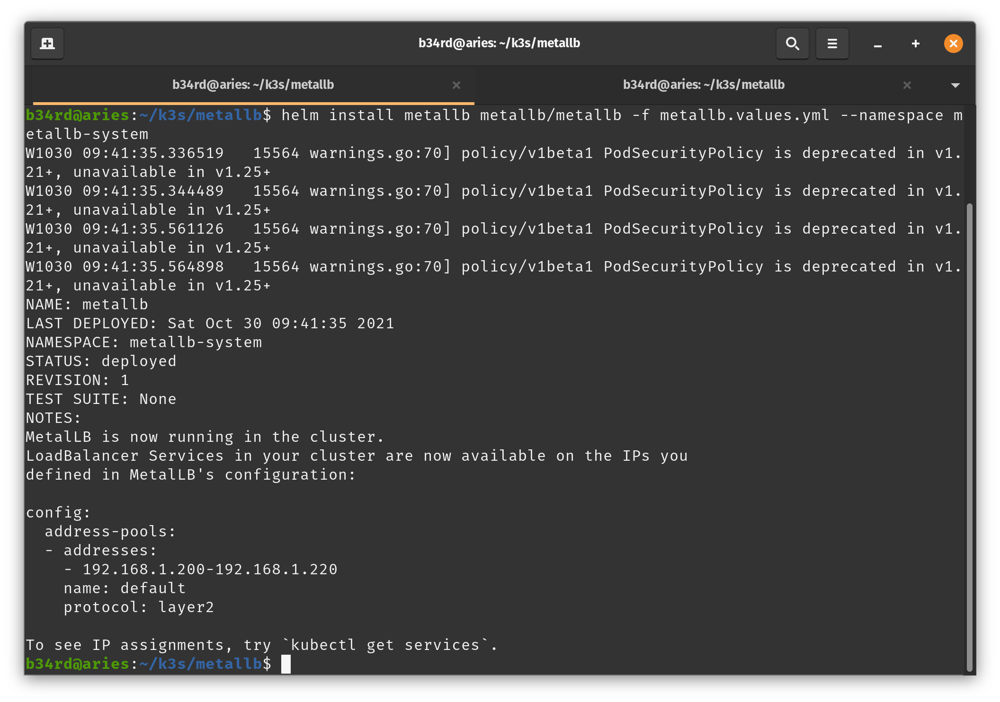

### Installing Rancher

Time for the big one. So far we have been doing everything from the terminal. I like the control and flexibility of it but let's be honest, having a web app that gives us all of these tools as well as some monitoring information will be very nice. Rancher also has the ability to manage multiple clusters and manage storage, backups, etc. It's a really powerful and useful tool. To get it installed, you guessed it, helm repo time!

```shellscript
helm repo add rancher-latest https://releases.rancher.com/server-charts/latest
helm repo update
```

There are actually three branches to this: stable, latest, alpha. If you are planning to use this in a production environment I would recommend stable. You have some options here, if you want to use let's encrypt certificates you can or you can go with self-signed. I'm going with self-signed since this is going to stay internal. Both options are listed below

Self-Signed Certs:

```shellscript
helm install rancher rancher-latest/rancher \
  --namespace cattle-system \
  --create-namespace \
  --set hostname=rancher.my.org \
  --set replicas=3
```

Let's Encrypt:

```shellscript
helm install rancher rancher-latest/rancher \
  --namespace cattle-system \
  --create-namespace \
  --set hostname=rancher.my.org \
  --set replicas=3 \
  --set ingress.tls.source=letsEncrypt \
  --set letsEncrypt.email=me@example.org
```

Let's break this down... first is the rancher image from the repo, the namespace, the hostname we are going to use in our network (adjust to your needs. Mine is rancher.local), the number of replicas, and for let's encrypt we have the ingress tls source. For me, I am only doing 1 replica and self-signed certs. My deployment looks like this:

```shellscript
helm install rancher rancher-latest/rancher \
  --namespace cattle-system \
  --create-namespace
  --set hostname=rancher.homelab \
  --set replicas=1
```

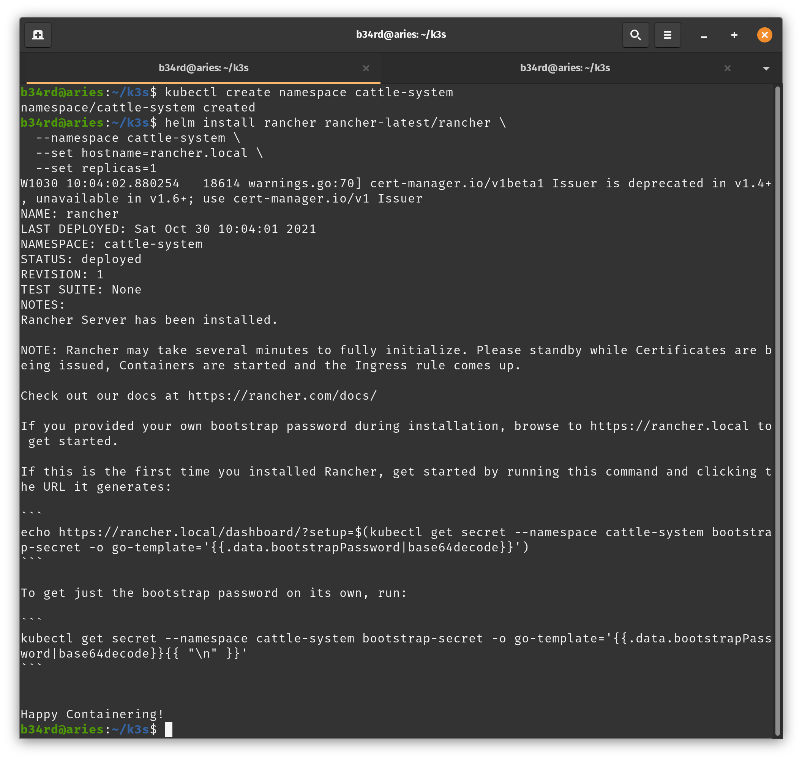

We need to wait a bit for Rancher to build everything out. We can watch the progress though!

```shellscript
watch kubectl get all -n cattle-system
```

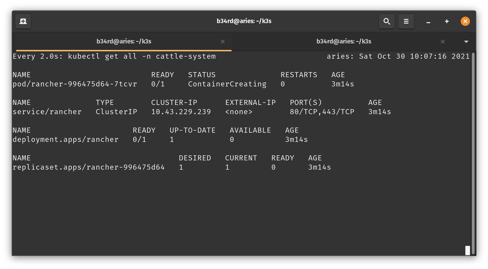

Remember, you can use the -o wide option also to see which worker nodes are taking on the tasks assigned. Make sure you watch in another terminal tab because we will need the helm output from earlier in a bit. This part can take a while so grab a coffee or a snack.

Once our kubectl output looks like this we are ready to grab some more info and get everything configured!


We can check our ingress also with kubectl

```shellscript
kubectl get ingress -n cattle-system
```

We need to edit the hosts file or create a DNS entry for this ingress. I just added it to the bottom of my /etc/hosts file.  We an just browse to IP but Rancher has some issues when not using fqdn. Make sure you use the name specified when deploying via helm. Open up a browser and open https://< dns name of rancher >. You will be greeted with Rancher setup pages.

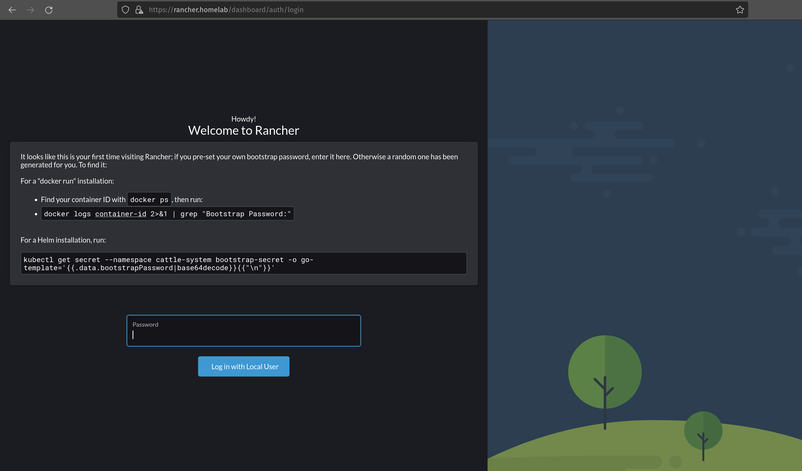

From here we can follow the helm installation instructions on the bottom, put in the value, and continue. You will next be prompted to setup a password, then a page where you can establish basic preferences. Let's just go view our cluster. Here we get a lot of options and some great info about the health of our cluster. We can manage deployments, pods, nodes, etc from here. If you look at individual nodes we can see their specific details also.

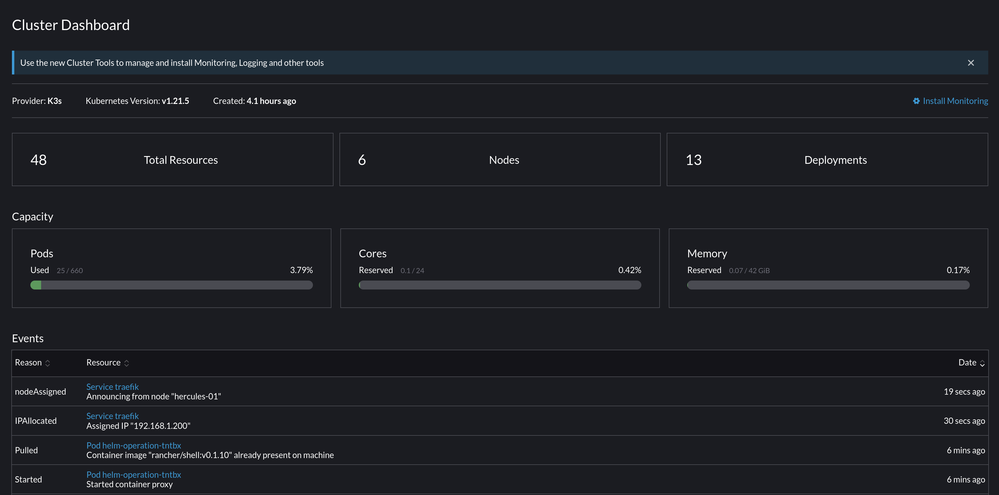


As you look around in Rancher you see you can manage helm repositories, install apps, manage deployments, pods, etc. You can do everything from scale deployments to executing a shell on individual containers. Once you're finished familiarizing yourself we are going to move to the next step.

### Installing Longhorn

We are going to install something from Rancher called Longhorn. What is Longhorn? Well, it's is a tool for storage that allows replication between all nodes, handles stateful storage well, does backups to cloud, etc. Really, if you have any persistent volumes, you want to use Longhorn.


First, we need to make sure we have all the pre-requisites installed. On all of our nodes in the cluser we need to install open-iscsi. This is as simple as just

```shellscript
sudo apt install open-iscsi
```

We also need to make sure all of our nodes are either in DNS or in host files on each node. Longhorn communicates both on the cluster network and the physical network. Without the DNS names sometimes it can be cranky. To fix that just add all nodes to the /etc/hosts file on each node.

Now we can install Longhorn with a couple of clicks in Rancher. If we are viewing our cluster details there is an option to Install Monitoring in the right. You can also click Cluster Tools in the bottom left or find Longhorn in the Apps & Marketplace. Once you find Longhorn click install.

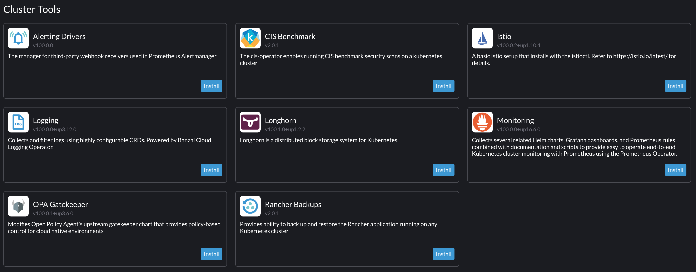

From here there is basic info and a project selection dropdown. Typically you avoid installing in the system project but because this is something we are integrating into our cluster to manage system storage, I am putting it there. The recommended setting is to create a new project just for Longhorn.


When we click next there are more options. I'm leaving everything as default. When we click Install we are shown the progress and wait for everything to get setup. This can take a bit of time depending on network and internet connections. Once finished we will be able to click the Longhorn option in Rancher and see all of our data. From here, I go right into configuration. In this page I just go down and make changes based on how I like things to function.

Here are things I configure

 1. Concurrent Automatic Engine Upgrade Per Node Limit - 2
 2. Default Data Locality: best-effort
 3. Backups: We will come back to these
 4. Replica Auto Balance: best-effort

Alright let's click save and then move to backups. I like a lot of redundancy so I'm using [Storj IO](https://storj.io) and creating s3 api credentials. Here, let's go over how to do this on their free tier.

After browsing to site, creating our account, and verifying e-mail we can create our bucket.

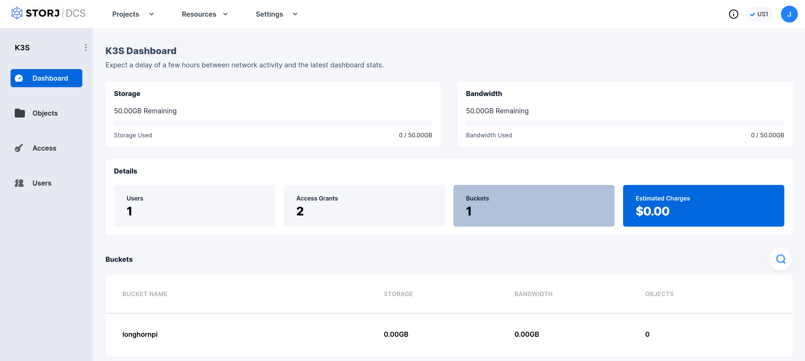

From here we need to select Access


Click Create Access Grant. On the following screen create a name for the access grant and click next.

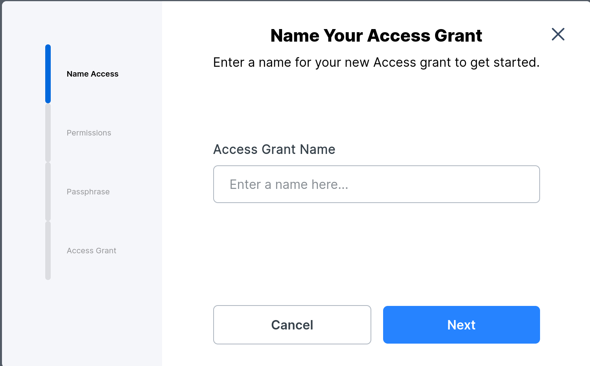

Now we specify the permissions we want Longhorn to have, we need to give it everything for the bucket. We also need to ensure we specify our bucket in the dropdown. Then click continue in browser.

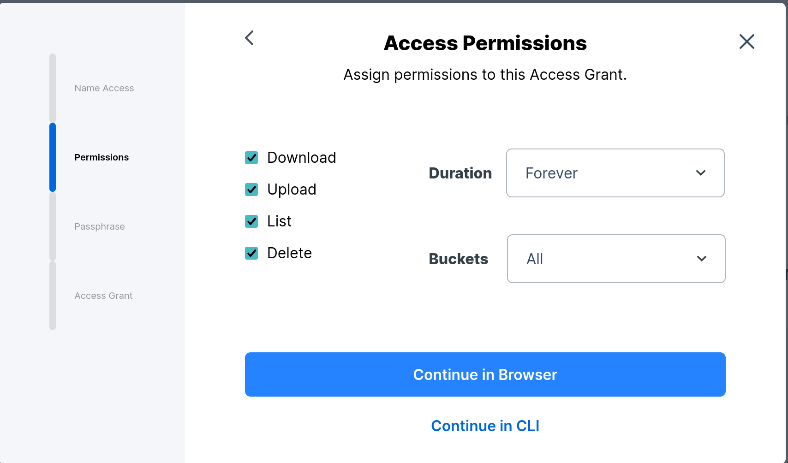

Now we will be asked for a passphrase. I highly recommend a sentence that you can easily remember. Something like "Longhorn is going to be backing up to this bucket". Once you have this click next.

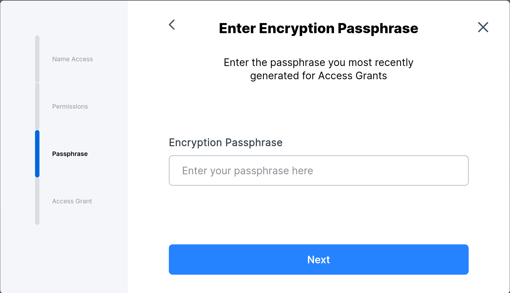

Now we have our key! After saving this click Generate S3 Gateway Credentials.


Finally we have our S3 info! Let's save all of this and head back over to Rancher.

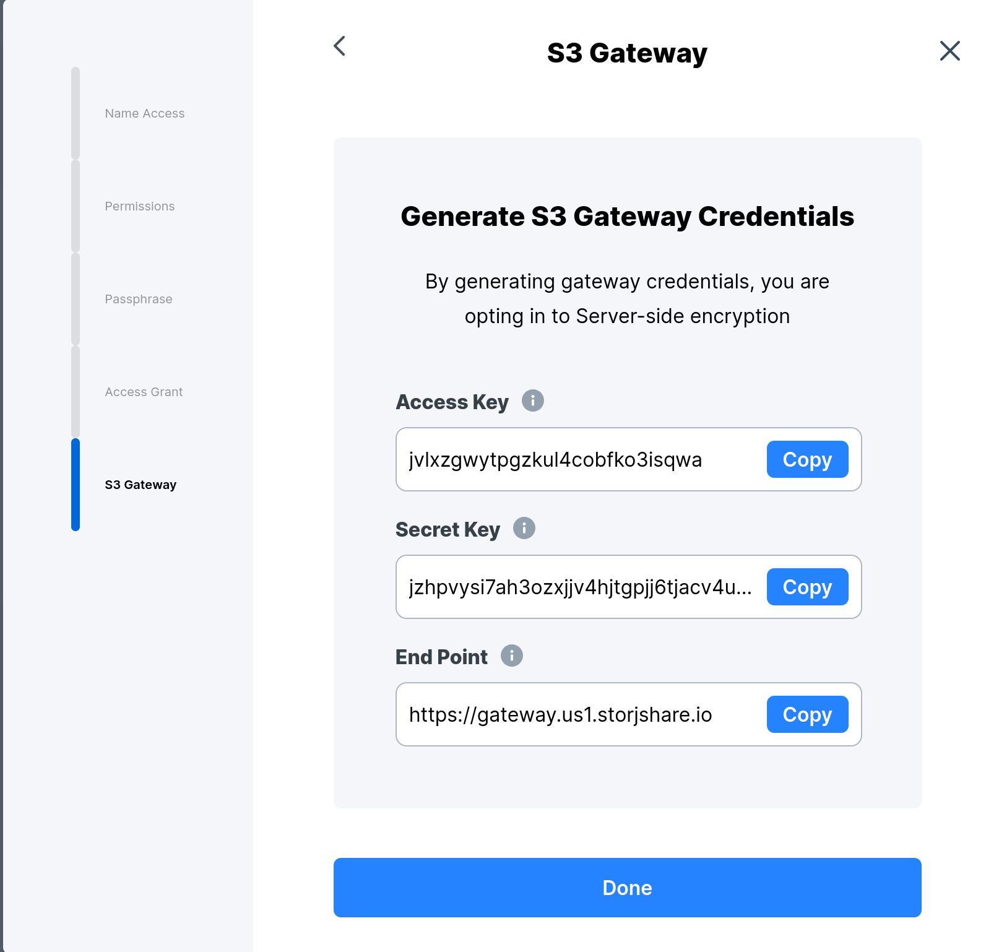

Now, I have shared all of these credentials with you for demonstration. They were immediately deleted. Back to Rancher. Here we will go into our cluster and where it has Namespaces on the top we need to drop down and go into our longhorn-system namespace.

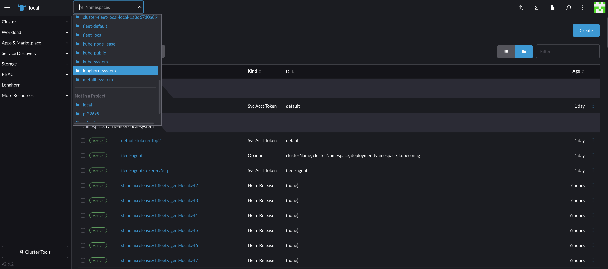

Once here we will go into Storage and Secrets.


Once here we need to create an Opaque Secret for our S3 bucket. So, we click create, then select Opaque. From here name this something like storj-s3 or s3-storj or whatever you'd like. Just make sure it is all lowercase and no spaces. We need to create a few key value pairs. They are honestly pretty simple. 

1. AWS_ACCESS_KEY_ID
2. AWS_SECRET_ACCESS_KEY
3. AWS_ENDPOINTS

We just put the corresponding value from storj.io s3 credentials we generated and click save. Once saved go back to All Namespaces up top and then click Longhorn on the left. We then need to go to our Longhorn General Settings page and scroll down to backups. Here we need to input our s3 backup target and our secret we just created. The backup target goes like this:

```shellscript
s3://<bucket>@region/
```

It will look something like mine


Click save and go to backup tab. It will take it a second or so to load and if all is well, we will have a blank list of backups!

Alright, whew... That was A LOT. I think this is a great stopping point as we have everything configured and are finally ready to get some applications and services installed. 

### Conclusion and optional things

Well, we accomplished a LOT!! We now have a fully HA cluster with cloud decentralized backups of our persistant data. That data is also replicated between all nodes in our cluster. There are a few other things to consider before moving on to installing apps. The HA embedded db snapshots can be backed up to the cloud also. We can create another bucket for those in storj or use another system if we want. If you want to go ahead and create some here's what you do...

```shellscript
sudo k3s etcd-snapshot \
  --s3 \
  --s3-bucket=<S3-BUCKET-NAME> \
  --s3-access-key=<S3-ACCESS-KEY> \
  --s3-secret-key=<S3-SECRET-KEY> \
  --s3-endpoint=<S3-ENDPOINT>
```

If we need to restore from one of these:

```shellscript
sudo k3s server \
  --cluster-init \
  --cluster-reset \
  --etcd-s3 \
  --cluster-reset-restore-path=<SNAPSHOT-NAME> \
  --etcd-s3-bucket=<S3-BUCKET-NAME> \
  --etcd-s3-access-key=<S3-ACCESS-KEY> \
  --etcd-s3-secret-key=<S3-SECRET-KEY> \
  --etcd-s3-endpoint=<S3-ENDPOINT>
```

If we want to delete a specific snapshot:

```shellscript
sudo k3s etcd-snapshot delete          \
  --s3                            \
  --s3-bucket=<S3-BUCKET-NAME>    \
  --s3-access-key=<S3-ACCESS-KEY> \
  --s3-secret-key=<S3-SECRET-KEY> \
  --s3-endpoint=<S3-ENDPOINT>
  <SNAPSHOT-NAME>
```

Finally, if we want to prune our snapshots and only keep a certain amount:

```shellscript
sudo k3s etcd-snapshot prune --snapshot-retention 10
```

We covered a LOT during this part and I hope it wasn't a dive into the deep end without knowing how to swim kind of thing. If there are any questions please don't hesitate to ask and as always, happy hacking!!

References:
 + <https://rancher.com/>
 + <https://rancher.com/docs/rancher/v2.5/en/installation/install-rancher-on-k8s/>
 + <https://rancher.com/docs/k3s/latest/en/installation/kube-dashboard/>
 + <https://rancher.com/docs/k3s/latest/en/backup-restore/>
 + <https://longhorn.io/>
 + <https://rancher.com/products/longhorn>
 + <https://metallb.org/>
 + <https://cert-manager.io/>
 + <https://storj.io>